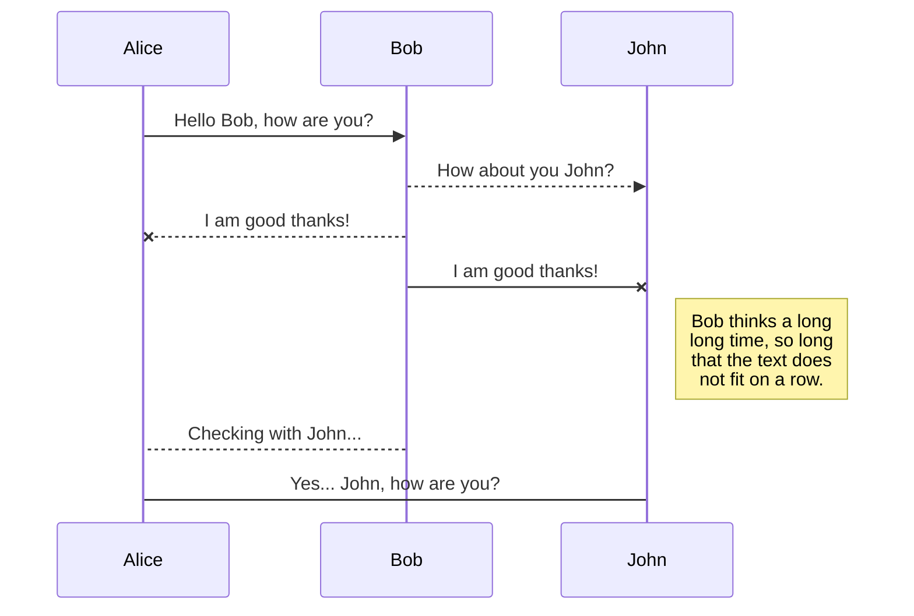
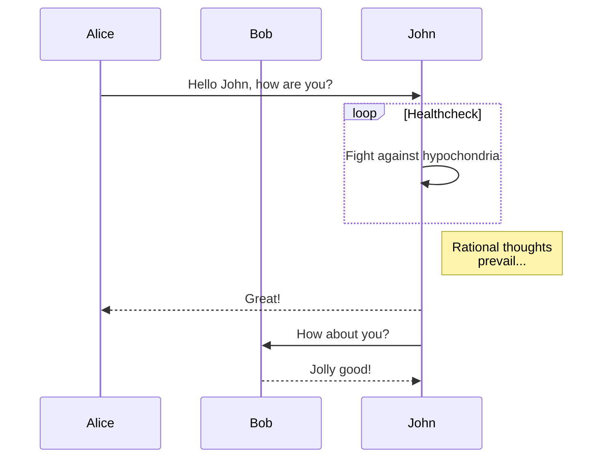
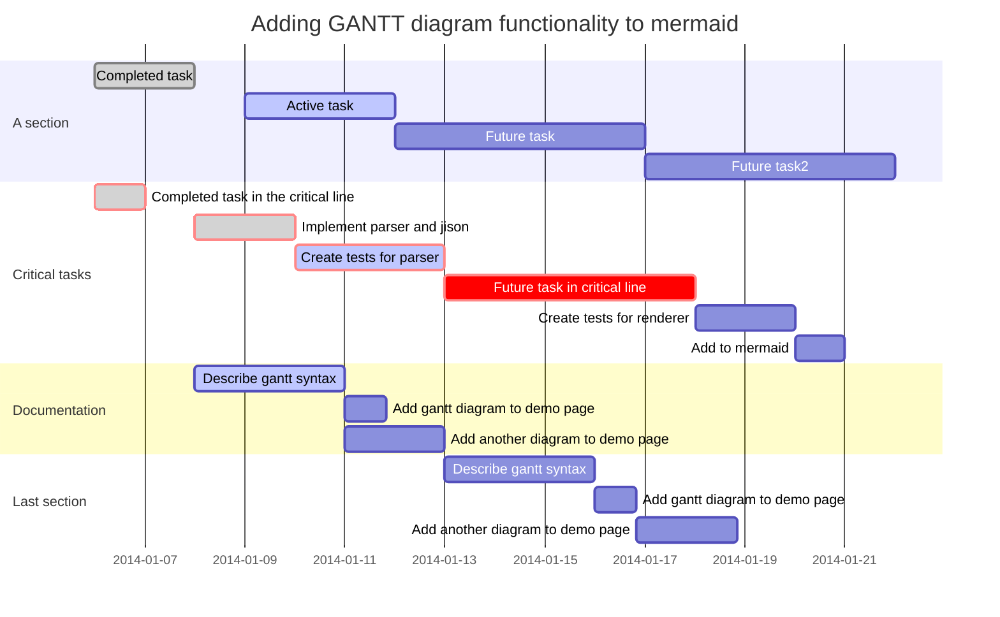
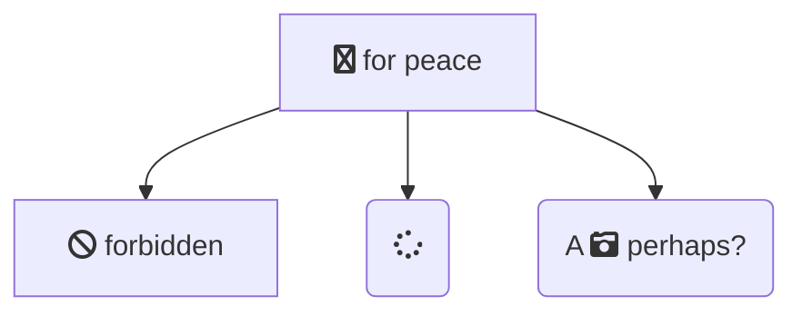

title: nodeppt 富媒体&插件演示
speaker: 三水清
url: https://github.com/ksky521/nodeppt
js:
    - https://www.echartsjs.com/asset/theme/infographic.js
plugins:
    - echarts: {theme: infographic}
    - katex

<slide class="bg-black-blue aligncenter" image="https://source.unsplash.com/Zq_K89I9E-8/ .dark">

Media & Plugin {.text-subtitle.animated.fadeInDown.delay-800}
# nodeppt {.text-landing.text-shadow}

这可能是迄今为止最好的网页版演示库 {.text-intro}

[:fa-github: Github](https://github.com/ksky521/nodeppt){.button.ghost}


<slide class="aligncenter">

## Media

<slide class="bg-black" video="https://webslides.tv/static/videos/working.mp4 poster='https://webslides.tv/static/images/working.jpg'" >


`.background-video`

## **WebSlides is the easiest way to make HTML presentations. Inspire and engage.**

<slide class="bg-blue aligncenter" video="https://webslides.tv/static/videos/working.mp4 poster='https://webslides.tv/static/images/working.jpg' .dark">


## BG Video with Overlay {.text-landing}

`<slide class="bg-blue aligncenter" video="https://webslides.tv/static/videos/working.mp4 poster='https://webslides.tv/static/images/working.jpg' .dark">` or `.light`


<slide class="fullscreen bg-blue" youtube=".dark id='_m67JbGjWnc' autoplay loop" :class="aligncenter">

## **Youtube Background**

`<slide youtube=".dark id='_m67JbGjWnc' autoplay loop">`

<slide class="aligncenter">

## Plugins


<slide :class="size-60">
## echarts {.aligncenter}


```echarts {style="height:100%;width:100%;"}
{
    tooltip: {
        trigger: 'item',
        formatter: "{a} <br/>{b}: {c} ({d}%)"
    },
    legend: {
        orient: 'vertical',
        x: 'left',
        data:['直达','营销广告','搜索引擎','邮件营销','联盟广告','视频广告','百度','谷歌','必应','其他']
    },
    series: [
        {
            name:'访问来源',
            type:'pie',
            selectedMode: 'single',
            radius: [0, '30%'],

            label: {
                normal: {
                    position: 'inner'
                }
            },
            labelLine: {
                normal: {
                    show: false
                }
            },
            data:[
                {value:335, name:'直达', selected:true},
                {value:679, name:'营销广告'},
                {value:1548, name:'搜索引擎'}
            ]
        },
        {
            name:'访问来源',
            type:'pie',
            radius: ['40%', '55%'],
            label: {
                normal: {
                    formatter: '{a|{a}}{abg|}\n{hr|}\n  {b|{b}：}{c}  {per|{d}%}  ',
                    backgroundColor: '#eee',
                    borderColor: '#aaa',
                    borderWidth: 1,
                    borderRadius: 4,
                    // shadowBlur:3,
                    // shadowOffsetX: 2,
                    // shadowOffsetY: 2,
                    // shadowColor: '#999',
                    // padding: [0, 7],
                    rich: {
                        a: {
                            color: '#999',
                            lineHeight: 22,
                            align: 'center'
                        },
                        // abg: {
                        //     backgroundColor: '#333',
                        //     width: '100%',
                        //     align: 'right',
                        //     height: 22,
                        //     borderRadius: [4, 4, 0, 0]
                        // },
                        hr: {
                            borderColor: '#aaa',
                            width: '100%',
                            borderWidth: 0.5,
                            height: 0
                        },
                        b: {
                            fontSize: 16,
                            lineHeight: 33
                        },
                        per: {
                            color: '#eee',
                            backgroundColor: '#334455',
                            padding: [2, 4],
                            borderRadius: 2
                        }
                    }
                }
            },
            data:[
                {value:335, name:'直达'},
                {value:310, name:'邮件营销'},
                {value:234, name:'联盟广告'},
                {value:135, name:'视频广告'},
                {value:1048, name:'百度'},
                {value:251, name:'谷歌'},
                {value:147, name:'必应'},
                {value:102, name:'其他'}
            ]
        }
    ]
}

```
<slide class="aligncenter">

## Plugins: mermaid

<slide :class="size-60">
## Basic sequence diagram {.aligncenter}





<slide :class="size-60">

## Message to self in loop {.aligncenter}



<slide :class="size-80">
## Gantt {.aligncenter}




<slide :class="size-60">

## Flowchart support for fontawesome {.aligncenter}



<slide class="aligncenter">

## Plugins: KaTex

<slide class="bg-gradient-v" :class="size-60">

## KaTex {.aligncenter}

| equation                                                                                                                                                                  | description                                                                            |
| ------------------------------------------------------------------------------------------------------------------------------------------------------------------------- | -------------------------------------------------------------------------------------- |
| $\nabla \cdot \vec{\mathbf{B}}  = 0$                                                                                                                                      | divergence of $\vec{\mathbf{B}}$ is zero                                               |
| $\nabla \times \vec{\mathbf{E}}\, +\, \frac1c\, \frac{\partial\vec{\mathbf{B}}}{\partial t}  = \vec{\mathbf{0}}$                                                          | curl of $\vec{\mathbf{E}}$ is proportional to the rate of change of $\vec{\mathbf{B}}$ |
| $\nabla \times \vec{\mathbf{B}} -\, \frac1c\, \frac{\partial\vec{\mathbf{E}}}{\partial t} = \frac{4\pi}{c}\vec{\mathbf{j}}    \nabla \cdot \vec{\mathbf{E}} = 4 \pi \rho$ | _wha?_                                                                                 |


<slide class="bg-primary" :class="size-60 frame">

## View More Demos? {.text-serif.aligncenter}

\* \* \* {.text-symbols}

<nav class="aligncenter">
* [:fa-th-large: Layout](./layout.html)
* [:fa-tv: Background](./background.html)
* [:fa-magic: Animation](./animation.html)
* [:fa-cube: Component](./component.html)
* [:fa-css3: Classes](./index.html)
</nav>

<slide class="aligncenter">

## U work so hard, **but** 干不过 write PPTs

快使用 [nodeppt](https://github.com/ksky521/nodeppt) 轻松搞定高大上PPT<br/> nodeppt 助力你的人生逆袭之路！ {.text-into}

[:fa-cloud-download: Github](https://github.com/ksky521/nodeppt){.button}
