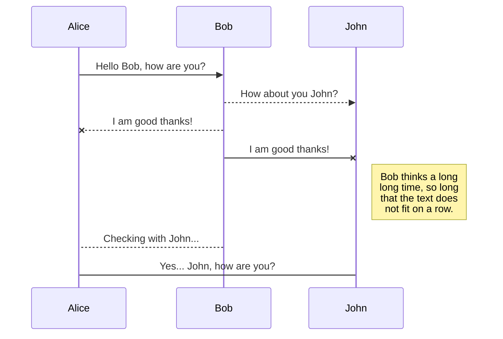
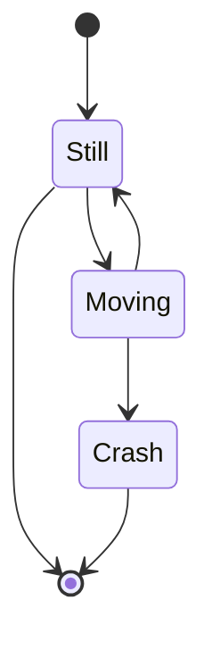
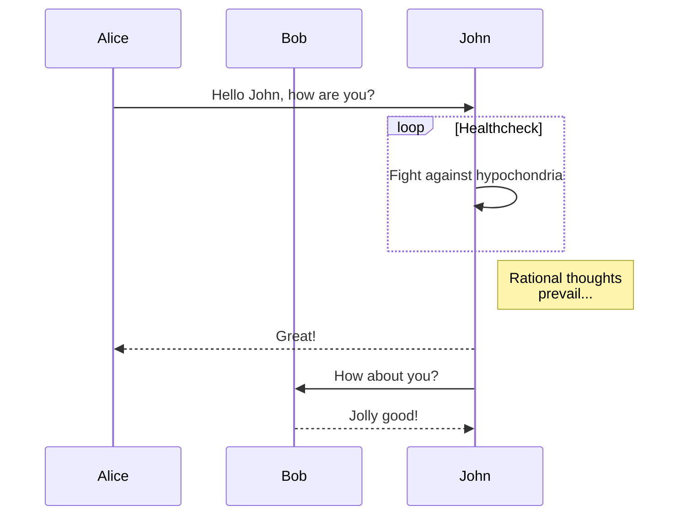
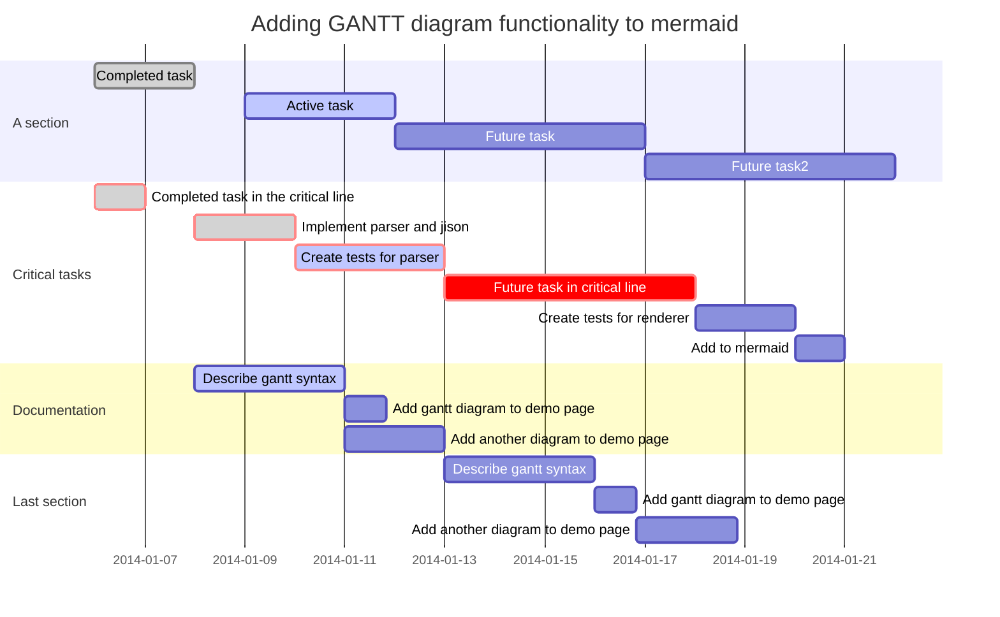
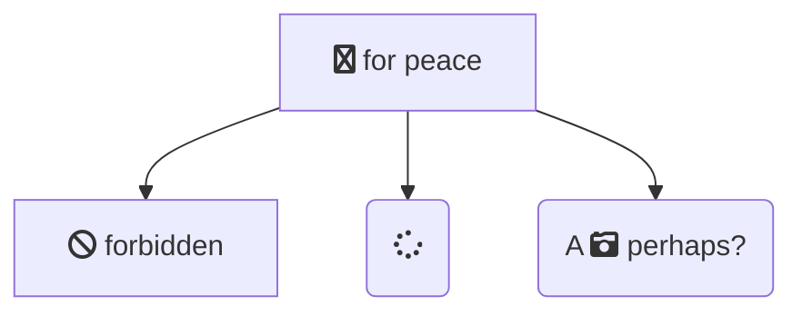

title: nodeppt - 这可能是迄今为止最好的网页版演示库
speaker: 三水清
url: https://github.com/ksky521/nodeppt
plugins:
    - mermaid: {theme: forest}

<slide class="bg-black-blue aligncenter" image="https://source.unsplash.com/Zq_K89I9E-8/ .dark">

mermaid {.text-subtitle.animated.fadeInDown.delay-800}
# nodeppt {.text-landing.text-shadow}

这可能是迄今为止最好的网页版演示库 {.text-intro}

[:fa-github: Github](https://github.com/ksky521/nodeppt){.button.ghost}

<slide class="aligncenter">

## mermaid

<slide :class="size-60">
## Basic sequence diagram {.aligncenter}

<slide :class="size-60">
## Mermaid can render state diagrams. {.aligncenter}

<slide :class="size-60">

## Message to self in loop {.aligncenter}

<slide :class="size-80">
## Gantt {.aligncenter}

<slide :class="size-60">

## Flowchart support for fontawesome {.aligncenter}

<slide class="bg-primary" :class="size-60 frame">

## View More Demos? {.text-serif.aligncenter}

\* \* \* {.text-symbols}

<nav class="aligncenter">
* [:fa-th-large: Layout](./layout.html)
* [:fa-tv: Background](./background.html)
* [:fa-magic: Animation](./animation.html)
* [:fa-cube: Component](./component.html)
* [:fa-css3: Classes](./index.html)
</nav>

<slide class="aligncenter">

## U work so hard, **but** 干不过 write PPTs

快使用 [nodeppt](https://github.com/ksky521/nodeppt) 轻松搞定高大上PPT  nodeppt 助力你的人生逆袭之路！ {.text-into}

[:fa-cloud-download: Github](https://github.com/ksky521/nodeppt){.button}
